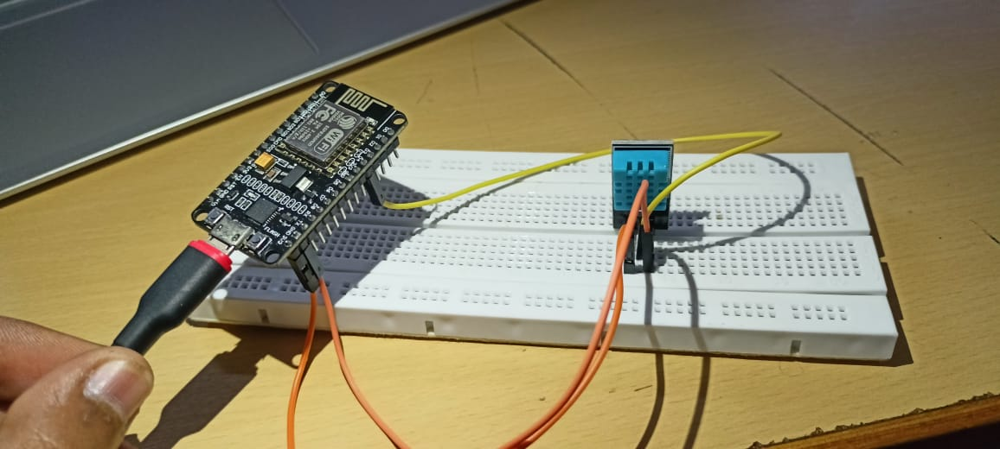
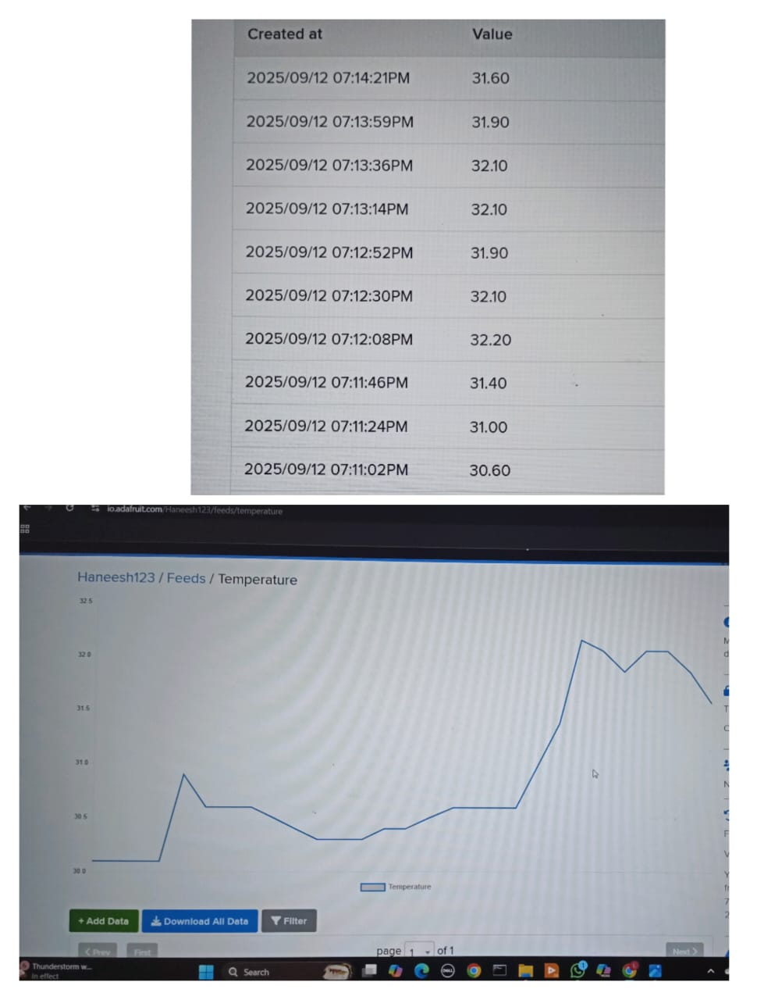
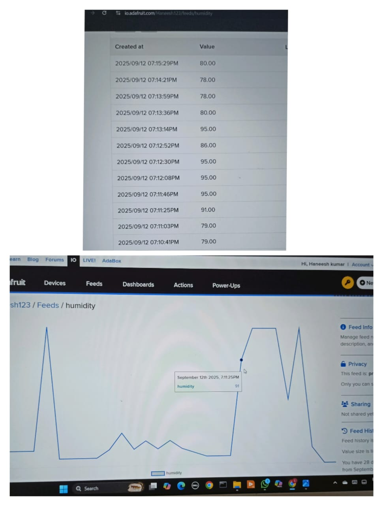
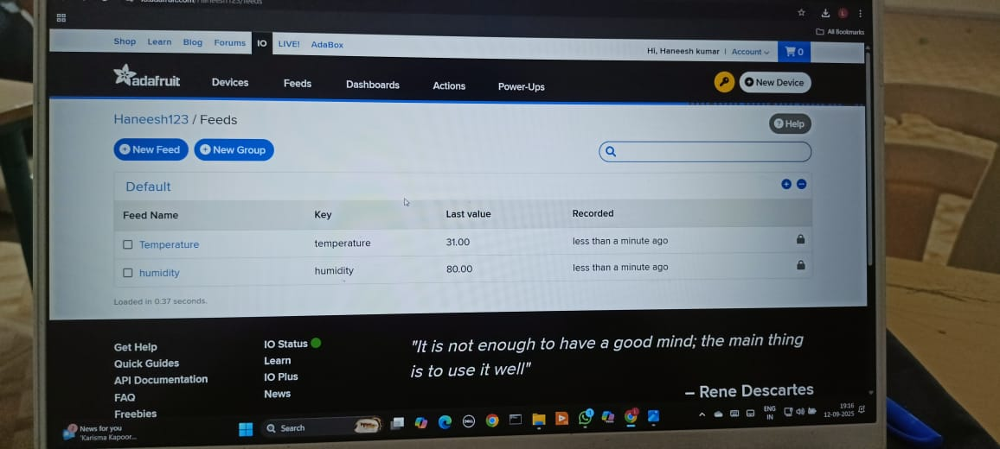
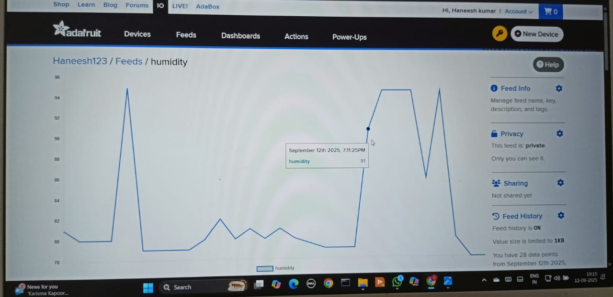
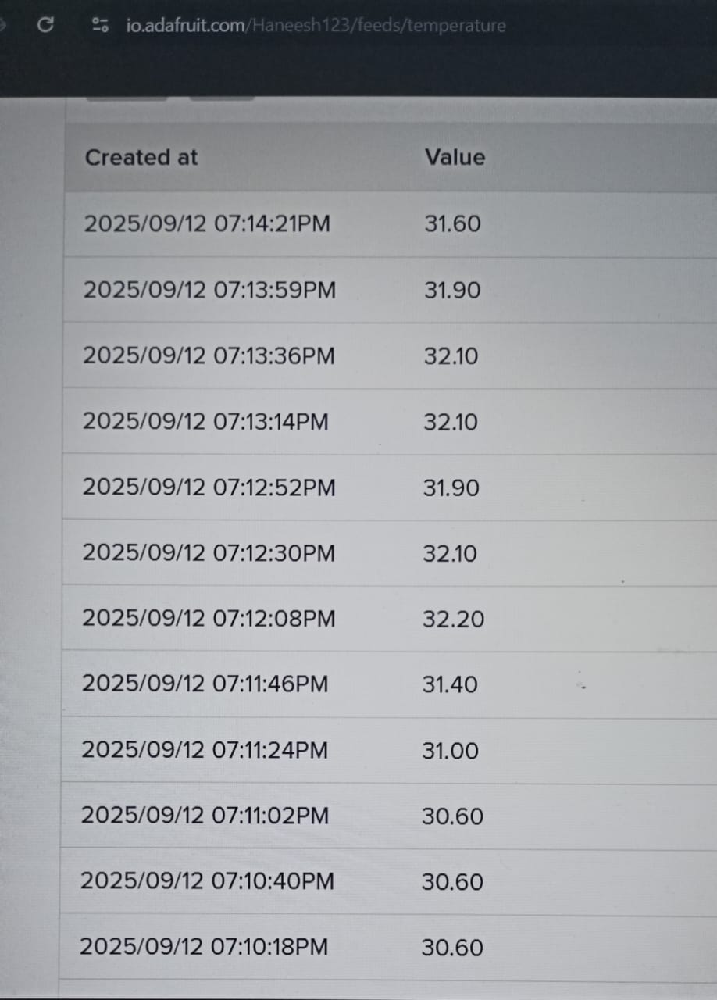
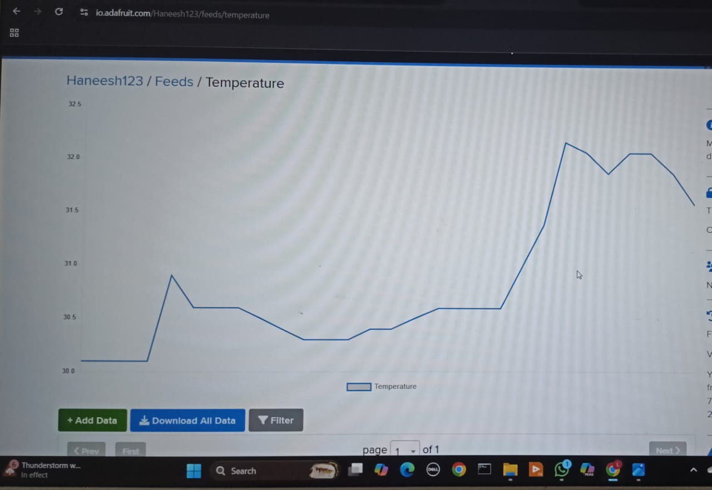

# IoT Weather Monitoring System

## Overview
This project monitors temperature and humidity using ESP8266 and DHT11 sensor and sends real-time data to the cloud using Adafruit IO. It also uses a machine learning model to predict future temperature and humidity values.

## Features
- Real-time temperature & humidity monitoring
- Cloud integration using Adafruit IO
- Live data visualization dashboard
- 
  ## Prediction
The system uses a Machine Learning model to predict future temperature and humidity values based on historical data.
- Model Used: Random Forest model
- Input: Historical sensor data
- Output: Predicted future values (next few hours)
This enhances the system from monitoring to intelligent forecasting.

## Components Used
- ESP8266
- DHT11 Sensor

## Working
Sensor collects data → ESP8266 processes → Data sent to Adafruit IO → Visualized on dashboard.

## Future Scope
- Automation based on sensor data

## Author
Lingutla Haneesh Kumar

## Output

### Circuit

### Dashboard / Results

